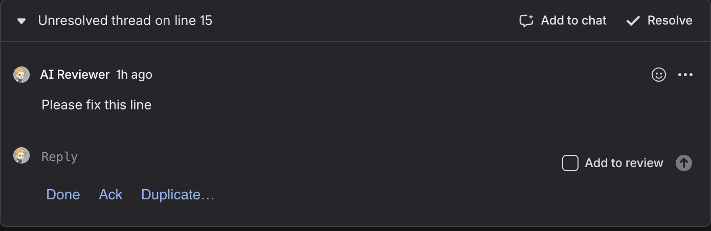
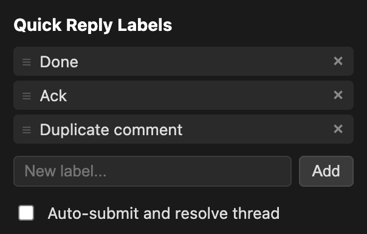

# Graphite Quick Reply

A Chrome extension that adds quick-reply buttons to code review comment threads on [app.graphite.com](https://app.graphite.com). One click to fill a common response, optionally auto-submit and resolve the thread.

## Features

- Quick-reply buttons appear below each reply textarea in comment threads
- Click a button to fill the textarea with a preset response (e.g. "Fixed", "Reverted")
- **Auto-submit and resolve**: when enabled, clicking a button will fill the text, uncheck "Add to review", submit the reply, and resolve the thread automatically
- Labels longer than 12 characters are truncated after the first word with an ellipsis (hover for full text)
- Configurable labels via the extension popup (add, remove, drag-and-drop reorder)
- Settings sync across Chrome profiles via `chrome.storage.sync`

## Installation

1. Clone or download this repository
2. Open `chrome://extensions` in Chrome
3. Enable **Developer mode** (toggle in the top right)
4. Click **Load unpacked** and select this project directory
5. Navigate to any PR on `app.graphite.com` — quick-reply buttons appear in comment threads

To configure labels or toggle auto-resolve, click the extension icon in Chrome's toolbar.

## Implementation

### Content Script (`content.js`)

The content script runs on `app.graphite.com` and handles all DOM interaction.

**DOM observation**: A `MutationObserver` on `document.body` watches for dynamically added `ThreadReply_threadReply__` elements (Graphite is a SPA, so threads appear and disappear as users navigate). All Graphite class selectors use prefix-match (`[class*="ComponentName_className__"]`) because the hash suffix changes across builds.

**Button injection**: For each ThreadReply, a row of buttons is inserted after the `CommentComposer` element. The buttons are placed outside the composer (not inside it) because the composer uses `display: grid` with `overflow: clip`, which clips extra children. The button row uses `grid-column: 2` to align with the content column of the ThreadReply grid.

**Click handling**: When the reply editor is collapsed, the ThreadReply grid doesn't fully allocate space for the button row, so browser hit-testing can attribute clicks to the ThreadReply background instead of the buttons. To work around this, click handlers are registered on the ThreadReply itself (capture phase) and match clicks by coordinate intersection with button bounding rects. On match, the textarea is focused first (which activates the collapsed editor), then filled after a short delay for React to expand it.

**Textarea fill**: Values are set using the native `HTMLTextAreaElement.prototype.value` setter and an `input` event dispatch, which is necessary to update React's controlled component state.

**Auto-submit and resolve**: When enabled, after filling the textarea the extension unchecks the "Add to review" checkbox, clicks the submit button, and then clicks the "Resolve" button in the thread header. The Resolve button is located by walking up to the nearest `Card_gdsCard__` ancestor (shared by the thread body and header) and searching for a button with "Resolve" text. A full pointer/mouse event sequence is dispatched (`pointerdown` → `mousedown` → `pointerup` → `mouseup` → `click`) to ensure React event handlers are triggered.

**Diagnostics**: `console.warn` calls with a `[GQR]` prefix are emitted whenever the expected DOM structure isn't found, making it easy to diagnose breakage if Graphite updates their UI.

### Popup (`popup.html`, `popup.js`)

Settings UI accessed via the extension toolbar icon. Supports adding/removing labels, drag-and-drop reordering, and toggling auto-submit/resolve. All changes are persisted to `chrome.storage.sync` and picked up live by the content script via `storage.onChanged`.

### Styles (`content.css`)

Buttons are styled to match Graphite's dark theme. The button row is positioned with `position: relative; z-index: 1` to mitigate stacking issues in the ThreadReply grid.

### Manifest (`manifest.json`)

Manifest V3. Content scripts are injected on `https://app.graphite.com/*`. The only permission required is `storage`.
